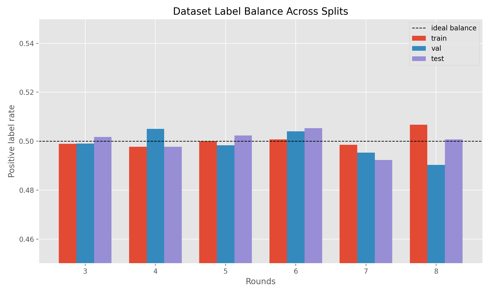
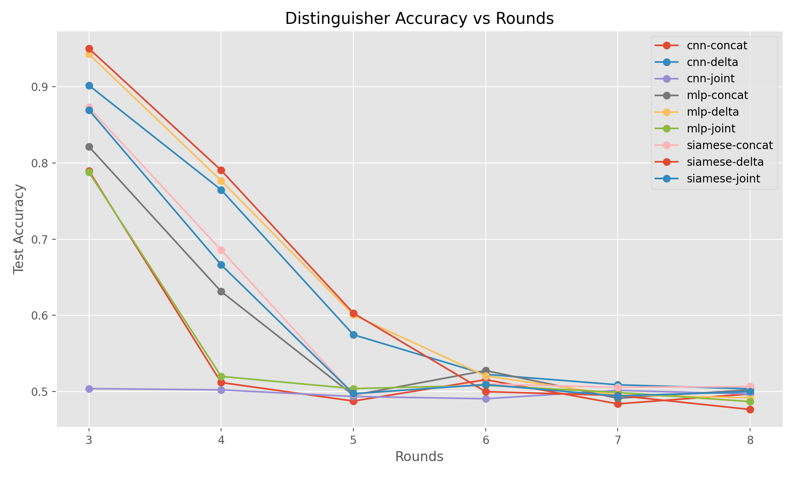
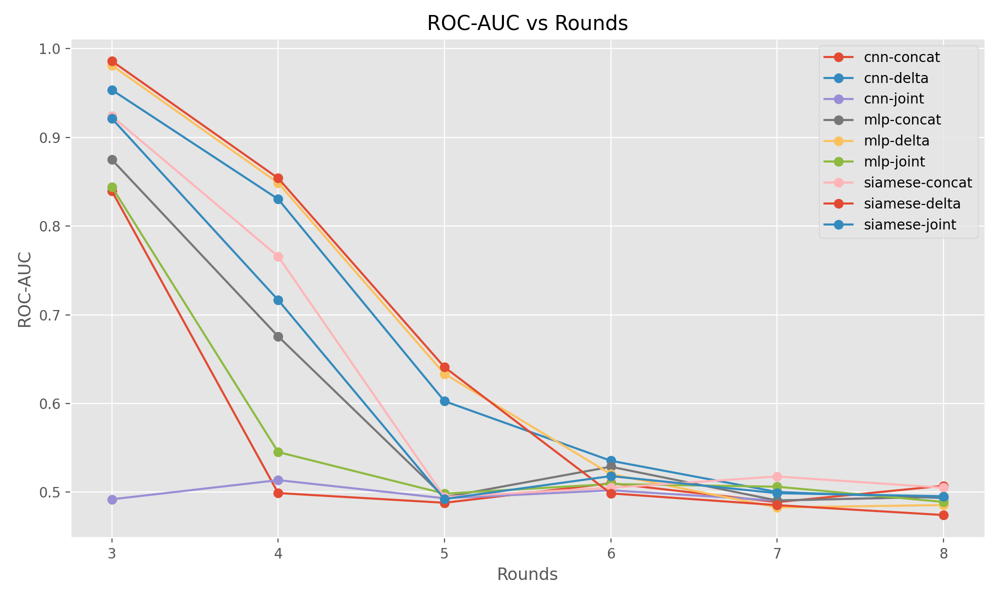
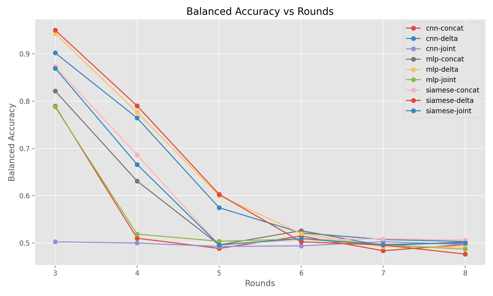
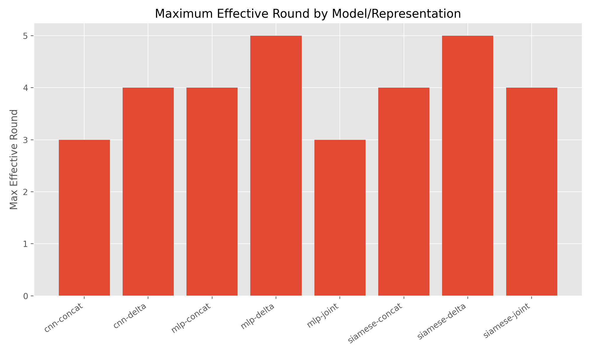

# Course Project ML-1

## Learning Plaintext-Ciphertext Relations using Machine Learning

**Name:** Arnav Batra  
**Roll Number:** 2022098

---

## Abstract

This project studies whether machine learning can distinguish a reduced-round block cipher from a random permutation by learning exploitable relations between paired plaintexts and their corresponding ciphertexts. The chosen primitive is **Speck32/64**, and the task is framed as a binary classification problem over paired samples generated with a fixed plaintext XOR difference. Three neural distinguishers were implemented and compared: a multi-layer perceptron (MLP), a one-dimensional convolutional neural network (CNN), and a Siamese network. Multiple input representations were evaluated, with particular attention to ciphertext differences. The experimental results show a strong distinguishability signal for low-round Speck, especially when the model is trained on ciphertext differences, but this signal decays quickly as the number of rounds increases. Under the current setup, the most reliable distinguishers remain effective up to approximately **5 rounds**, after which performance approaches chance.

## 1. Introduction

Classical differential cryptanalysis exploits structured relations between differences in plaintext pairs and the corresponding differences in ciphertext pairs. This project explores whether a data-driven model can learn those relations automatically, without manually specifying differential trails. The main question is:

> Given labeled samples produced either by a reduced-round cipher or by a random permutation, can a neural model learn a relation-based distinguisher that remains effective as the round count increases?

This report presents the full implementation, the dataset generation process, the chosen feature encodings, the model architectures, and the observed experimental results.

## 2. Problem Setup

Let \( F \) be either:

1. A reduced-round block cipher \( E_k \), or
2. A random permutation \( \pi \).

For a fixed input XOR difference \( \Delta P \), the learner receives pairs:

\[
(P, P \oplus \Delta P)
\]

and corresponding outputs:

\[
(C, C') = (F(P), F(P \oplus \Delta P))
\]

Each sample is labeled as:

- \( y = 1 \) if the outputs came from the cipher
- \( y = 0 \) if the outputs came from the random permutation

The goal is to learn a distinguisher that predicts whether a sample is cipher-generated or random-generated.

## 3. Cryptographic Setup

### 3.1 Chosen Primitive

The implementation uses **Speck32/64**, a lightweight ARX block cipher with:

- Block size: 32 bits
- Key size: 64 bits
- Word size: 16 bits

This cipher was chosen because it is simple to implement, fast to evaluate, and well-suited for round-wise distinguishability experiments.

### 3.2 Fixed Plaintext Difference

The experiments use the fixed plaintext XOR difference:

```text
Delta_P = 0x0040
```

### 3.3 Random Baseline

The random baseline is implemented as a **lazy random permutation oracle over the queried domain**. For each new queried plaintext, the oracle assigns a fresh unused 32-bit output and stores the mapping. This preserves permutation behavior on the sampled dataset without materializing the full \( 2^{32} \)-element permutation.

### 3.4 Rounds Evaluated

The experiments sweep the following reduced-round settings:

```text
3, 4, 5, 6, 7, 8 rounds
```

## 4. Dataset Generation

### 4.1 Sampling Procedure

For each round count, the following process is used:

1. Sample random plaintexts \( P \)
2. Compute paired plaintexts \( P' = P \oplus \Delta P \)
3. Generate outputs with either reduced-round Speck or the random permutation oracle
4. Assign the binary label \( y \)

### 4.2 Dataset Sizes

For every tested round count, the dataset is split as follows:

| Split | Samples |
| --- | ---: |
| Train | 12,000 |
| Validation | 3,000 |
| Test | 3,000 |

This gives **18,000 samples per round** and **108,000 total samples** across the six round settings.

### 4.3 Dataset Integrity

The generated data passed the main quality checks:

- Labels stayed very close to perfectly balanced in every split
- Test ciphertext arrays had no sampled output collisions
- The random baseline remained consistent for repeated queries
- Split generation was reproducible from fixed seeds



*Figure 1. Positive label rates remain close to the ideal 0.5 across all rounds and splits, indicating balanced datasets.*

The full balance table is available in [tables/dataset_balance.csv](tables/dataset_balance.csv).

## 5. Input Representations

Three input representations were implemented and compared.

### 5.1 Ciphertext Difference (`delta`)

\[
\Delta C = C \oplus C'
\]

This is the most directly inspired by differential cryptanalysis and turned out to be the strongest representation in practice.

### 5.2 Concatenated Ciphertexts (`concat`)

\[
C \Vert C'
\]

This representation retains the full ciphertext pair and lets the model learn its own comparison function.

### 5.3 Joint Plaintext-Ciphertext Representation (`joint`)

\[
(P, C, P \oplus \Delta P, C')
\]

This gives the model both the input pair and output pair, but it also increases dimensionality significantly.

All representations are encoded as bit vectors before being fed into the neural models.

## 6. Machine Learning Models

Three distinguishers were implemented.

### 6.1 Multi-Layer Perceptron (MLP)

The MLP operates on flattened bit vectors and uses two hidden layers with ReLU activations and dropout. It serves as a strong generic baseline for fixed-length binary features.

### 6.2 One-Dimensional CNN

The CNN applies one-dimensional convolutions over the bit sequence to capture local bit dependencies and short patterns that might correlate with differential structure.

### 6.3 Siamese Network

The Siamese model splits the input into two halves, encodes them through a shared branch network, and classifies based on both embeddings and their absolute difference. This architecture is especially natural for pair-based data and performed best on the strongest representation.

## 7. Experimental Protocol

### 7.1 Training Setup

- Optimizer: Adam
- Learning rate: 0.001
- Weight decay: 0.00001
- Batch size: 256
- Maximum epochs: 12
- Early stopping patience: 4
- Device: CPU

### 7.2 Success Metrics

The most important evaluation metrics are:

- **ROC-AUC**: measures how well a model separates cipher and random samples over all thresholds
- **Balanced accuracy**: protects against misleading success from biased class predictions
- **Confusion counts**: reveal whether both classes are being distinguished properly

Plain accuracy is still reported, but it is not treated as sufficient by itself.

## 8. Results

### 8.1 Accuracy by Round



*Figure 2. Test accuracy for all model-representation combinations across round counts.*

Accuracy gives a quick high-level picture, but it is not always reliable on its own because some models drift toward one class when the task becomes hard.

### 8.2 ROC-AUC by Round



*Figure 3. ROC-AUC across round counts. The `delta` representation clearly dominates at low rounds.*

ROC-AUC shows the most consistent signal. The `delta` representation remains clearly above chance through round 5, while the other representations decay faster.

### 8.3 Balanced Accuracy by Round



*Figure 4. Balanced accuracy confirms that meaningful distinguishability largely disappears after round 5.*

Balanced accuracy reinforces the same conclusion: once the round count reaches 6, most models behave close to random guessing.

### 8.4 Best Model Per Round

The best result at each round was selected by ROC-AUC.

| Round | Best Model | Representation | Accuracy | Balanced Accuracy | ROC-AUC |
| --- | --- | --- | ---: | ---: | ---: |
| 3 | Siamese | delta | 0.9500 | 0.9500 | 0.9860 |
| 4 | Siamese | delta | 0.7903 | 0.7899 | 0.8539 |
| 5 | Siamese | delta | 0.6030 | 0.6030 | 0.6410 |
| 6 | CNN | delta | 0.5227 | 0.5216 | 0.5354 |
| 7 | Siamese | concat | 0.5057 | 0.5090 | 0.5177 |
| 8 | CNN | concat | 0.4970 | 0.4969 | 0.5072 |

This table shows a clear transition:

- Strong and reliable signal at 3 rounds
- Useful but weaker signal at 4 rounds
- Marginal but still non-trivial signal at 5 rounds
- Near-chance behavior from 6 rounds onward

### 8.5 Maximum Effective Round

To identify the maximum usable round count, the following criterion was used:

- ROC-AUC \( \ge 0.60 \)
- Balanced Accuracy \( \ge 0.60 \)



*Figure 5. The `delta` representation remains effective longest, especially for the Siamese and MLP distinguishers.*

| Model | Representation | Maximum Effective Round |
| --- | --- | ---: |
| CNN | concat | 3 |
| CNN | delta | 4 |
| MLP | concat | 4 |
| MLP | delta | 5 |
| MLP | joint | 3 |
| Siamese | concat | 4 |
| Siamese | delta | 5 |
| Siamese | joint | 4 |

The strongest configurations in this project are therefore:

- **Siamese + delta**
- **MLP + delta**

Both remain effective up to **5 rounds**.

## 9. Discussion

### 9.1 Why `delta` Works Best

The ciphertext-difference representation aligns most directly with the idea behind differential cryptanalysis. Instead of forcing the network to first infer a useful comparison from raw pairs, it gives the network the relation itself as the primary feature. This appears to reduce learning difficulty and improve generalization.

### 9.2 Why `joint` Underperformed

The `joint` representation provides more information, but it also produces a much larger input vector. With the current model sizes and training budget, the extra dimensions likely make optimization harder without adding enough useful signal.

### 9.3 Interpretation of the Round Limit

The drop in distinguishability after round 5 suggests that the relation induced by the chosen plaintext difference becomes too weak for these models to exploit effectively under the current sample budget. This does not prove that no distinguisher exists beyond 5 rounds, only that the current pipeline does not learn a robust one there.

## 10. Limitations and Future Work

This implementation is strong enough for the assignment deliverables, but it still has natural extensions:

- Try additional plaintext differences and search for stronger differential signals
- Compare against a hand-crafted classical differential distinguisher
- Add more ciphers such as Simon or Present for cross-cipher analysis
- Experiment with larger models or longer training on the `joint` representation
- Add transfer-learning or round-curriculum experiments

## 11. Conclusion

This project successfully implemented a full machine-learning-based cryptanalytic pipeline for distinguishing reduced-round Speck32/64 from a random permutation. The system includes reproducible dataset generation, three neural distinguishers, multiple feature encodings, plotting utilities, and report-generation assets.

The main empirical conclusion is:

> For the chosen setup, machine-learning distinguishers are highly effective at low rounds, remain meaningfully effective through about **5 rounds**, and then degrade toward chance.

Among all tested configurations, the **Siamese network on ciphertext differences** produced the strongest overall results.

## 12. Reproducibility

The complete experiment and report assets can be rebuilt with:

```powershell
python scripts/run_experiments.py --config configs/default.yaml
python scripts/build_report_assets.py --config configs/default.yaml
```

Key generated artifacts:

- Full results: [tables/summary_for_report.csv](tables/summary_for_report.csv)
- Best-by-round summary: [tables/best_by_round.csv](tables/best_by_round.csv)
- Effective round table: [tables/max_effective_rounds.csv](tables/max_effective_rounds.csv)
- Dataset balance table: [tables/dataset_balance.csv](tables/dataset_balance.csv)

## Appendix: Implementation Files

Important implementation files include:

- `src/mlcrypto/crypto/speck.py`
- `src/mlcrypto/crypto/random_permutation.py`
- `src/mlcrypto/data/generation.py`
- `src/mlcrypto/data/representations.py`
- `src/mlcrypto/models/mlp.py`
- `src/mlcrypto/models/cnn.py`
- `src/mlcrypto/models/siamese.py`
- `src/mlcrypto/train/trainer.py`
- `src/mlcrypto/train/experiment.py`
